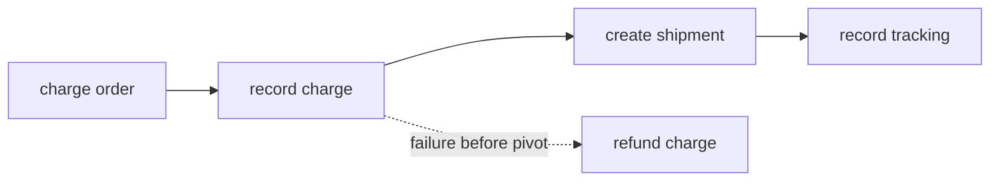

# Compact checkout and scheduled report

These packages are the two short examples on the Ogha product page.

## Checkout

```bash
python -m checkout.worker
python -m checkout.submit
```

`checkout.charge_order` uses `order:<id>:charge` at the provider boundary. If shipping fails before
the pivot, the declared compensation can reimburse the recorded charge. Shipment creation is the
point of no return in this intentionally small example.



Source: [`src/checkout/workflows.py`](../src/checkout/workflows.py),
[`src/checkout/steps.py`](../src/checkout/steps.py), and the
[`checkout adapters`](../src/checkout/adapters).

## Reports

```bash
python -m reports.worker
```

Worker startup creates `reports.daily-kpis`. The engine evaluates the five-field UTC cron and
creates deterministic occurrence run IDs even while workers are offline. The worker is needed to
execute an occurrence, not to remember that the occurrence exists.

Source: [`src/reports/workflows.py`](../src/reports/workflows.py).

