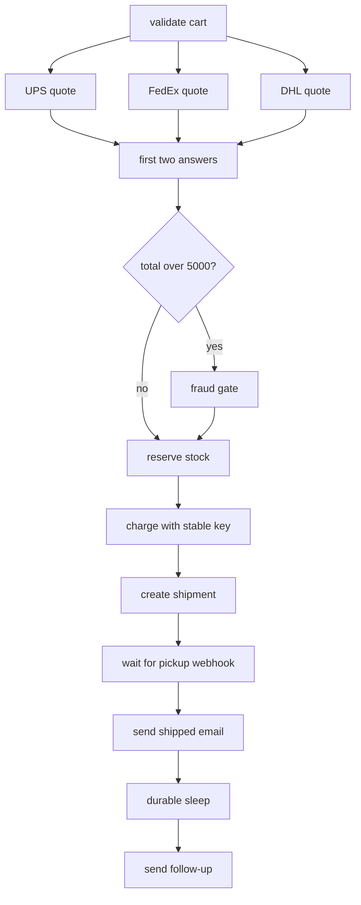

# Ecommerce order workflow

This is the complete order use case from the docs: parallel carrier quotes, a first-two quorum, a
fraud gate, payment, shipment, an asynchronous carrier callback, and a later follow-up.

## Run a normal order

```bash
# terminal 1
python -m ecommerce.worker

# terminal 2
RUN_ID=$(python -m ecommerce.submit)
python -m ecommerce.webhooks ship "$RUN_ID"
```

The run parks on `carrier_pickup` without holding a worker. The webhook resolves that exact pending
promise and execution continues with email and the durable follow-up sleep.

## Run a reviewed order

```bash
RUN_ID=$(python -m ecommerce.submit --amount 6000)
python -m ecommerce.webhooks review "$RUN_ID" approve --reviewer analyst-42
python -m ecommerce.webhooks ship "$RUN_ID"
```

To exercise the denial branch, replace `approve` with `deny`. If no decision arrives within the
gate timeout, the gate rejects; the workflow catches `PermissionDenied` and returns a visible
business rejection.

## What happens



The quote fan-out is genuinely distributed because the workflow declares
`execution="async_distributed"`. After two replies, `Handle.settled` identifies the unfinished
call locally and `ctx.cancel` rejects it.

## Source map

- Composition: [`src/ecommerce/workflow.py`](../src/ecommerce/workflow.py)
- Durable units and policies: [`src/ecommerce/steps.py`](../src/ecommerce/steps.py)
- External boundaries: [`src/ecommerce/adapters`](../src/ecommerce/adapters)
- Webhook and reviewer boundary: [`src/ecommerce/webhooks.py`](../src/ecommerce/webhooks.py)
- Processes: [`worker.py`](../src/ecommerce/worker.py) and
  [`submit.py`](../src/ecommerce/submit.py)

The local payment, inventory, shipping, and mail adapters persist results in SQLite by business
idempotency key. They model the contract expected from real providers; they are not Ogha storage.

