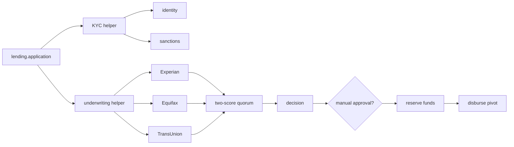

# Lending platform

The lending example treats KYC, underwriting, disbursement, statements, and the application as
named workflows sharing one deployment target.

## Run the main paths

```bash
# terminal 1
python -m lending.worker

# terminal 2: automatic approval
python -m lending.submit --score 730 --amount 100000 --wait

# low score
python -m lending.submit --score 500 --amount 100000 --wait

# manual review
RUN_ID=$(python -m lending.submit --score 730 --amount 400000)
python -m lending.approvals approve "$RUN_ID" --underwriter analyst-7
```

Use `deny` instead of `approve` to exercise a business rejection.

## Architecture



The bureau calls fan out, the first two durable results win, and the remaining handle is canceled.
Reserve is compensable; disbursement is the pivot. Both treasury calls use stable applicant-based
keys because a task fence changes across attempts and is not a business effect identity.

## Standalone stages

`lending.kyc`, `lending.underwriting`, and `lending.disbursement` wrap the same stage helpers used
by `lending.application`. You can submit one stage independently for testing or operations without
duplicating its logic.

`lending.month_end` accepts this input:

```json
{
  "period": "2026-08",
  "borrowers": [{"id": "BORROWER-1"}, {"id": "BORROWER-2"}]
}
```

It eagerly starts one explicitly detached `lending.statement` run per borrower. The accounting period is input data; the
workflow never reads the wall clock, so replay remains deterministic.

## Source map

- Provider ports: [`src/lending/adapters`](../src/lending/adapters)
- Steps: [`src/lending/steps.py`](../src/lending/steps.py)
- Reusable stage composition: [`src/lending/stages.py`](../src/lending/stages.py)
- Six workflows: [`src/lending/workflows.py`](../src/lending/workflows.py)
- Worker, submitter, reviewer: [`src/lending`](../src/lending)
