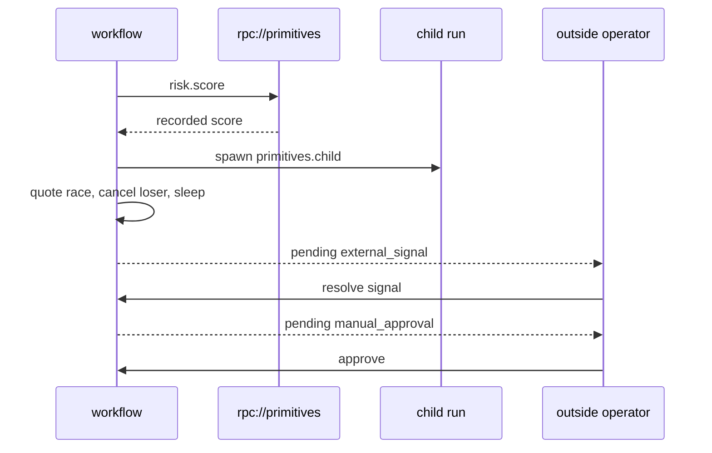

# The nine methods, running together

`primitives.tour` deliberately uses the complete workflow surface in one short run.

| Method | Line of business meaning in this tour |
| :--- | :--- |
| `call` | normalize input and request provider quotes |
| `rpc` | invoke `risk.score` by service and method name |
| `spawn` | start an independently visible child record run |
| `join` | race quotes and await the child |
| `sleep` | park for one second without a worker |
| `wait` | await an external system callback |
| `gate` | require an operator decision that denies on silence |
| `emit` | write a milestone to the run timeline |
| `cancel` | stop the quote that lost the race |

## Run it

```bash
# terminal 1
python -m primitives.worker

# terminal 2
RUN_ID=$(python -m primitives.submit --amount 250)
python -m primitives.operator signal "$RUN_ID"
python -m primitives.operator approve "$RUN_ID"
```

The worker's `service="primitives"` makes it listen on both `python://primitives` and
`rpc://primitives`. The RPC payload names `risk.score`, which is an ordinary `@ogha.step`
registered in that serving process.



Canonical source: [`src/primitives/methods.py`](../src/primitives/methods.py).

