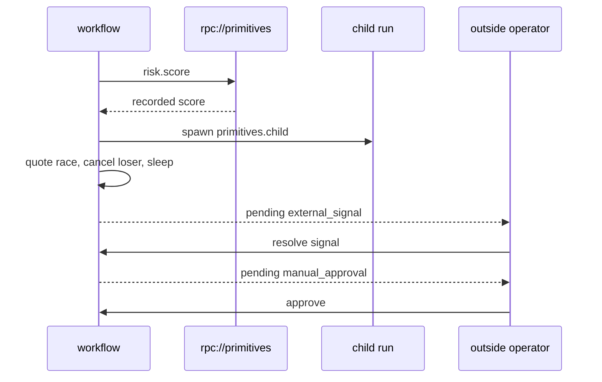

# The compact App surface, running together

`primitives.tour` deliberately exercises the ordinary App-owned workflow surface in one short run.
Application code uses durable function objects and control helpers directly.

| Method | Line of business meaning in this tour |
| :--- | :--- |
| `step(...)` | normalize input and request provider quotes as direct typed calls |
| `remote(...)` | invoke `risk.score` across a service boundary |
| `child_workflow.spawn(...)` | eagerly start an owned child run |
| `join(..., count=...)` | await all, the first, or a threshold of handles |
| `sleep` | park for one second without a worker |
| `signal` | await an external system callback |
| `ogha.signal(ogha.Approval(...))` | require an operator decision that denies on silence |
| `event` | write a milestone to the run timeline |
| `cancel` | stop the quote that lost the race |

## Run it

```bash
# terminal 1
python -m primitives.worker

# terminal 2
RUN_ID=$(python -m primitives.submit --amount 250)
python -m primitives.operator signal "$RUN_ID"
python -m primitives.operator approve "$RUN_ID"
```

The App name `primitives` makes its worker listen on both `python://primitives` and
`rpc://primitives`. The typed `@app.remote("primitives", name="risk.score")` declaration routes to
the ordinary `@app.step(name="risk.score")` registered in that serving process.



Canonical source: [`src/primitives/methods.py`](../src/primitives/methods.py).
