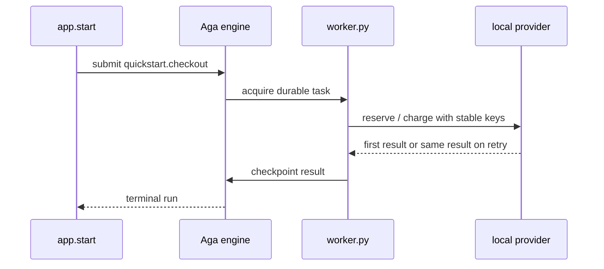
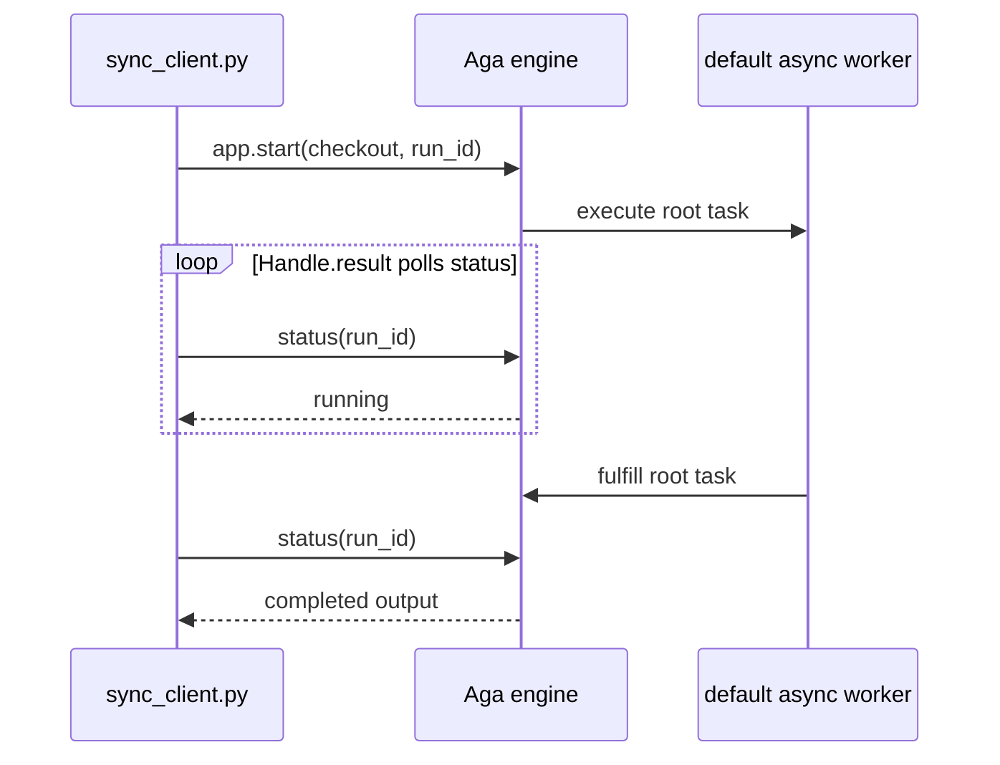

# Quickstart, synchronous waiting, crash recovery, and schedules

This guide backs the Python SDK page. It starts with one checkout and then exposes the two cases
that are easy to describe but important to see: a process dying in the middle of a step, and a cron
schedule that belongs to the engine rather than the worker.

## Mental model



Aga persists every identified call as a promise. Recovery replays the workflow and returns an
already committed value at each matching call instead of repeating it. The provider remembers
effect identity. Both are needed:
the engine cannot know whether a remote payment committed when a worker disappeared before
receiving its response.

## Run the basic workflow

```bash
docker compose up -d
python -m quickstart.worker
```

In another terminal:

```bash
python -m quickstart.sync_client
```

Expected result: one `quickstart.checkout` run reaches `COMPLETED`; its output contains the order,
reservation, charge, and receipt IDs. Re-run the command to create a new business order.

## Synchronous caller versus asynchronous submission

Aga has two worker-placement modes: `async` and `async_distributed`. Synchronous waiting is
an independent client choice, not a third mode. The workflow declares its real placement:

```python
from quickstart.app import app

@app.workflow(
    name="quickstart.checkout",
    execution="async",
)
async def checkout(order):
    validated = await validate_order(order)
    return {"order_id": order["id"], "total": validated["total"]}
```

The dedicated client starts the Run and waits on its Handle:

```python
result = app.start(checkout.options(run_id=order["id"]), order).result()
```

`App.start` submits once; `Handle.result` waits for the terminal record and restores the workflow's
declared Python result type. If the waiting process is killed, the engine and worker continue because
neither the Run nor its lease belongs to the caller connection. Omit `.result()` when the caller should
return immediately with the eager `Handle`.



Run both caller styles against the same worker:

```bash
python -m quickstart.submit       # returns the run ID immediately
python -m quickstart.sync_client  # waits and prints the decoded result
python -m quickstart.submit --wait  # compact equivalent of the second command
```

The SDK checks the terminal record observed by `Handle.result`. A failed or canceled workflow becomes
an application error instead of being mistaken for a successful empty response. Caller interruption
does not cancel the durable run.

Canonical files:

- [`src/quickstart/client.py`](../src/quickstart/client.py)
- [`src/quickstart/workflows.py`](../src/quickstart/workflows.py)
- [`src/quickstart/worker.py`](../src/quickstart/worker.py)
- [`src/quickstart/submit.py`](../src/quickstart/submit.py)
- [`src/quickstart/sync_client.py`](../src/quickstart/sync_client.py)

## Prove crash recovery

1. Stop the regular quickstart worker.
2. Start `python -m quickstart.crash_worker`.
3. Submit `quickstart.crash-recovery` with the short Python command below.
4. When `audit.log` contains `START`, kill the worker process with `kill -9`.
5. Start `python -m quickstart.crash_worker` again.

```bash
python - <<'PY'
import json, uuid
from quickstart.app import app
from quickstart.crash_workflow import crash_recovery

run_id = f"crash-{uuid.uuid4().hex[:12]}"
order = {"id": run_id, "items": [{"sku": "demo", "price": 1, "qty": 1}]}
app.start(crash_recovery.options(run_id=run_id), order)
print(run_id)
PY
```

`START` can appear twice. That is the honest failure window: the file write happened, but the
worker died before Aga knew the step finished. A production provider operation must use the same
stable key on the retry. The inventory adapter in this example does exactly that.

Canonical files: [`crash_workflow.py`](../src/quickstart/crash_workflow.py) and
[`crash_worker.py`](../src/quickstart/crash_worker.py).

## Operate the schedule

Importing `quickstart.schedules` registers `quickstart.daily-report`. Worker startup converges that
declaration into the engine.

```bash
python -m quickstart.schedule_admin list
python -m quickstart.schedule_admin pause quickstart.daily-report
python -m quickstart.schedule_admin resume quickstart.daily-report
```

Every edit reads the current revision and writes `revision + 1`. That makes competing deployments
converge forward instead of overwriting a newer declaration with an older one.

## Common failures

- A run remains pending with no worker: the submit target and worker target differ.
- A schedule is absent: the module containing `@app.schedule(...)` was never imported before
  `app.serve()` built the worker.
- An effect appears twice: the external adapter did not implement a stable idempotency key.
- A workflow changes behavior after restart: it read time, randomness, environment, or network I/O
  in the workflow body instead of a recorded step.
