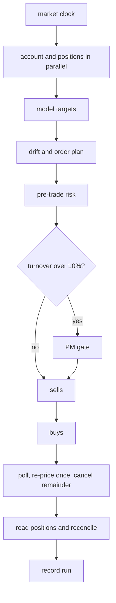

# Scheduled trading operations

This workflow belongs around trading operations, not in a latency-sensitive matching or signal
path. It turns target weights into a reviewed, ordered, reconciled rebalance run.

## Run with the local broker

The deterministic broker is the default and requires no credentials.

```bash
# terminal 1
python -m trading.worker

# terminal 2
RUN_ID=$(python -m trading.submit growth --date 2026-08-25)
python -m trading.operator approve "$RUN_ID" --reviewer portfolio-manager
```

The initial mock book creates turnover above 10%, so the run waits at the review gate. Orders fill
after two status checks and the final positions reconcile to target weights.

## Execution shape



The stable `client_order_id` is derived from run, side, and symbol. A retry first looks up that ID;
if a previous POST succeeded but its response was lost, the adapter returns the existing order.

## Use Alpaca paper trading

```bash
python -m pip install -e ".[alpaca]"
export TRADING_BROKER=alpaca
export ALPACA_KEY_ID=...
export ALPACA_SECRET=...
python -m trading.worker
```

The adapter only targets Alpaca's paper endpoint. Paper credentials are still secrets. The sample
is an integration demonstration, not investment advice or a production risk system.

## Source map

- Portfolio arithmetic: [`src/trading/domain.py`](../src/trading/domain.py)
- Durable steps: [`src/trading/steps.py`](../src/trading/steps.py)
- Workflow and engine schedule: [`src/trading/workflows.py`](../src/trading/workflows.py)
- Broker contract and local implementation: [`src/trading/adapters`](../src/trading/adapters)
- Operator boundary: [`src/trading/operator.py`](../src/trading/operator.py)

